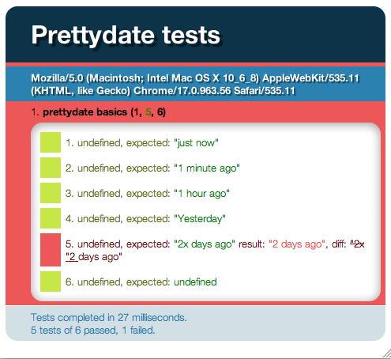

# [Introduction to Unit Testing](http://qunitjs.com/intro/)

You probably know that testing is good, but the first hurdle to overcome when trying to write unit tests for client-side code is the lack of any actual units; JavaScript code is written for each page of a website or each module of an application and is closely intermixed with back-end logic and related HTML. In the worst case, the code is completely mixed with HTML, as inline events handlers.

This is likely the case when no JavaScript library for some DOM abstraction is being used; writing inline event handlers is much easier than using the DOM APIs to bind those events. More and more developers are picking up a library such as jQuery to handle the DOM abstraction, allowing them to move those inline events to distinct scripts, either on the same page or even in a separate JavaScript file. However, putting the code into separate files doesn’t mean that it is ready to be tested as a unit.

What is a unit anyway? In the best case, it is a pure function that you can deal with in some way — a function that always gives you the same result for a given input. This makes unit testing pretty easy, but most of the time you need to deal with side effects, which here means DOM manipulations. It’s still useful to figure out which units we can structure our code into and to build unit tests accordingly.

## [Building Unit Tests](http://qunitjs.com/intro/#building-unit-tests)

With that in mind, we can obviously say that starting with unit testing is much easier when starting something from scratch. But that’s not what this article is about. This article is to help you with the harder problem: extracting existing code and testing the important parts, potentially uncovering and fixing bugs in the code.

The process of extracting code and putting it into a different form, without modifying its current behavior, is called refactoring. Refactoring is an excellent method of improving the code design of a program; and because any change could actually modify the behaviour of the program, it is safest to do when unit tests are in place.

This chicken-and-egg problem means that to add tests to existing code, you have to take the risk of breaking things. So, until you have solid coverage with unit tests, you need to continue manually testing to minimize that risk.

That should be enough theory for now. Let’s look at a practical example, testing some JavaScript code that is currently mixed in with and connected to a page. The code looks for links with `title` attributes, using those titles to display when something was posted, as a relative time value, like “5 days ago”:

```html
<!doctype html>
<html>
<head>
  <meta charset="utf-8">
  <title>Mangled date examples</title>
  <script>
  function prettyDate(time){
    var date = new Date(time || ""),
      diff = (((new Date()).getTime() - date.getTime()) / 1000),
      day_diff = Math.floor(diff / 86400);
 
    if ( isNaN(day_diff) || day_diff < 0 || day_diff >= 31 )
      return;
 
    return day_diff == 0 && (
        diff < 60 && "just now" ||
        diff < 120 && "1 minute ago" ||
        diff < 3600 && Math.floor( diff / 60 ) +
          " minutes ago" ||
        diff < 7200 && "1 hour ago" ||
        diff < 86400 && Math.floor( diff / 3600 ) +
          " hours ago") ||
      day_diff == 1 && "Yesterday" ||
      day_diff < 7 && day_diff + " days ago" ||
      day_diff < 31 && Math.ceil( day_diff / 7 ) +
        " weeks ago";
  }
  window.onload = function() {
    var links = document.getElementsByTagName("a");
    for ( var i = 0; i < links.length; i++ ) {
      if ( links[i].title ) {
        var date = prettyDate(links[i].title);
        if ( date ) {
          links[i].innerHTML = date;
        }
      }
    }
  };
  </script>
</head>
<body>
 
<ul>
  <li class="entry" id="post57">
    <p>blah blah blah...</p>
    <small class="extra">
      Posted <span class="time">
        <a href="/2008/01/blah/57/" title="2008-01-28T20:24:17Z">
          <span>January 28th, 2008</span>
        </a>
      </span>
      by <span class="author"><a href="/john/">John Resig</a></span>
    </small>
  </li>
  <!-- more list items -->
</ul>
 
</body>
</html>
```

If you ran that example, you’d see a problem: none of the dates get replaced. The code works, though. It loops through all anchors on the page and checks for a `title` property on each. If there is one, it passes it to the `prettyDate` function. If `prettyDate` returns a result, it updates the `innerHTML` of the link with the result.

## [Make Things Testable](http://qunitjs.com/intro/#make-things-testable)

The problem is that for any date older then 31 days, `prettyDate `just returns undefined (implicitly, with a single `return` statement), leaving the text of the anchor as is. So, to see what’s supposed to happen, we can hardcode a “current” date:

```html
<!doctype html>
<html>
<head>
  <meta charset="utf-8">
  <title>Mangled date examples</title>
  <script>
  function prettyDate(now, time){
    var date = new Date(time || ""),
      diff = (((new Date(now)).getTime() - date.getTime()) / 1000),
      day_diff = Math.floor(diff / 86400);
 
    if ( isNaN(day_diff) || day_diff < 0 || day_diff >= 31 )
      return;
 
    return day_diff == 0 && (
        diff < 60 && "just now" ||
        diff < 120 && "1 minute ago" ||
        diff < 3600 && Math.floor( diff / 60 ) +
          " minutes ago" ||
        diff < 7200 && "1 hour ago" ||
        diff < 86400 && Math.floor( diff / 3600 ) +
          " hours ago") ||
      day_diff == 1 && "Yesterday" ||
      day_diff < 7 && day_diff + " days ago" ||
      day_diff < 31 && Math.ceil( day_diff / 7 ) +
        " weeks ago";
  }
  window.onload = function() {
    var links = document.getElementsByTagName("a");
    for ( var i = 0; i < links.length; i++ ) {
      if ( links[i].title ) {
        var date = prettyDate("2008-01-28T22:25:00Z",
          links[i].title);
        if ( date ) {
          links[i].innerHTML = date;
        }
      }
    }
  };
  </script>
</head>
<body>
 
<ul>
  <li class="entry" id="post57">
    <p>blah blah blah...</p>
    <small class="extra">
      Posted <span class="time">
        <a href="/2008/01/blah/57/" title="2008-01-28T20:24:17Z">
          <span>January 28th, 2008</span>
        </a>
      </span>
      by <span class="author"><a href="/john/">John Resig</a></span>
    </small>
  </li>
  <-- more list items -->
</ul>
 
</body>
</html>
```

- [Run this example.](http://qunitjs.com/resources/intro/1-mangled.html)

Now, the links should say “2 hours ago,” “Yesterday” and so on. That’s something, but still not an actual testable unit. So, without changing the code further, all we can do is try to test the resulting DOM changes. Even if that did work, any small change to the markup would likely break the test, resulting in a really bad cost-benefit ratio for a test like that.

## [Refactoring, Stage 0](http://qunitjs.com/intro/#refactoring-stage-0)

Instead, let’s refactor the code just enough to have something that we can unit test.

We need to make two changes for this to happen: pass the current date to the `prettyDate` function as an argument, instead of having it just use `new Date`, and extract the function to a separate file so that we can include the code on a separate page for unit tests.

```html
<!doctype html>
<html>
<head>
  <meta charset="utf-8">
  <title>Refactored date examples</title>
  <script src="prettydate.js"></script>
  <script>
  window.onload = function() {
    var links = document.getElementsByTagName("a");
    for ( var i = 0; i < links.length; i++ ) {
      if ( links[i].title ) {
        var date = prettyDate("2008-01-28T22:25:00Z",
          links[i].title);
        if ( date ) {
          links[i].innerHTML = date;
        }
      }
    }
  };
  </script>
</head>
<body>
 
<ul>
  <li class="entry" id="post57">
    <p>blah blah blah...</p>
    <small class="extra">
      Posted <span class="time">
        <a href="/2008/01/blah/57/" title="2008-01-28T20:24:17Z">
          <span>January 28th, 2008</span>
        </a>
      </span>
      by <span class="author"><a href="/john/">John Resig</a></span>
    </small>
  </li>
  <-- more list items -->
</ul>
 
</body>
</html>
```

Here’s the contents of `prettydate.js`:

```js
function prettyDate(now, time){
  var date = new Date(time || ""),
    diff = (((new Date(now)).getTime() - date.getTime()) / 1000),
    day_diff = Math.floor(diff / 86400);
 
  if ( isNaN(day_diff) || day_diff < 0 || day_diff >= 31 )
    return;
 
  return day_diff == 0 && (
      diff < 60 && "just now" ||
      diff < 120 && "1 minute ago" ||
      diff < 3600 && Math.floor( diff / 60 ) +
        " minutes ago" ||
      diff < 7200 && "1 hour ago" ||
      diff < 86400 && Math.floor( diff / 3600 ) +
        " hours ago") ||
    day_diff == 1 && "Yesterday" ||
    day_diff < 7 && day_diff + " days ago" ||
    day_diff < 31 && Math.ceil( day_diff / 7 ) +
      " weeks ago";
}
```

- [Run this example.](http://qunitjs.com/resources/intro/2-getting-somewhere.html)

Now that we have something to test, let’s write some actual unit tests:

```html
<!doctype html>
<html>
<head>
  <meta charset="utf-8">
  <title>Refactored date examples</title>
  <script src="prettydate.js"></script>
  <script>
  function test(then, expected) {
    results.total++;
    var result = prettyDate("2008/01/28 22:25:00", then);
    if (result !== expected) {
      results.bad++;
      console.log("Expected " + expected +
        ", but was " + result);
    }
  }
  var results = {
    total: 0,
    bad: 0
  };
  test("2008/01/28 22:24:30", "just now");
  test("2008/01/28 22:23:30", "1 minute ago");
  test("2008/01/28 21:23:30", "1 hour ago");
  test("2008/01/27 22:23:30", "Yesterday");
  test("2008/01/26 22:23:30", "2 days ago");
  test("2007/01/26 22:23:30", undefined);
  console.log("Of " + results.total + " tests, " +
    results.bad + " failed, " +
    (results.total - results.bad) + " passed.");
  </script>
</head>
<body>
 
</body>
</html>
```

- [Run this example.](http://qunitjs.com/resources/intro/3-first-test.html) (Make sure to enable a console such as Firebug or Chrome’s Web Inspector.)

This will create an ad-hoc testing framework, using only the console for output. It has no dependencies to the DOM at all, so you could just as well run it in a non-browser JavaScript environment, such as Node.js or Rhino, by extracting the code in the `script` tag to its own file.

If a test fails, it will output the expected and actual result for that test. In the end, it will output a test summary with the total, failed and passed number of tests.

If all tests have passed, like they should here, you would see the following in the console:

> Of 6 tests, 0 failed, 6 passed.

To see what a failed assertion looks like, we can change something to break it:

> Expected 2 day ago, but was 2 days ago.
> Of 6 tests, 1 failed, 5 passed.

While this ad-hoc approach is interesting as a proof of concept (you really can write a test runner in just a few lines of code), it’s much more practical to use an existing unit testing framework that provides better output and more infrastructure for writing and organizing tests.

## [The QUnit JavaScript Test Suite](http://qunitjs.com/intro/#the-qunit-javascript-test-suite)

The choice of framework is mostly a matter of taste. For the rest of this article, we’ll use [QUnit](http://docs.jquery.com/Qunit) (pronounced “q-unit”), because its style of describing tests is close to that of our ad-hoc test framework.

```html
<!doctype html>
<html>
<head>
  <meta charset="utf-8">
  <title>Refactored date examples</title>
 
  <link rel="stylesheet" href="../qunit.css">
  <script src="../qunit.js"></script>
  <script src="prettydate.js"></script>
 
  <script>
  test("prettydate basics", function() {
    var now = "2008/01/28 22:25:00";
    equal(prettyDate(now, "2008/01/28 22:24:30"), "just now");
    equal(prettyDate(now, "2008/01/28 22:23:30"), "1 minute ago");
    equal(prettyDate(now, "2008/01/28 21:23:30"), "1 hour ago");
    equal(prettyDate(now, "2008/01/27 22:23:30"), "Yesterday");
    equal(prettyDate(now, "2008/01/26 22:23:30"), "2 days ago");
    equal(prettyDate(now, "2007/01/26 22:23:30"), undefined);
  });
  </script>
</head>
<body>
 
<div id="qunit"></div>
 
</body>
</html>
```

- [Run this example.](http://qunitjs.com/resources/intro/4-qunit-test.html)

Three sections are worth a closer look here. Along with the usual HTML boilerplate, we have three included files: two files for QUnit (`qunit.css` and `qunit.js`) and the previous `prettydate.js`.

Then, there’s another script block with the actual tests. The `test` method is called once, passing a string as the first argument (naming the test) and passing a function as the second argument (which will run the actual code for this test). This code then defines the `now` variable, which gets reused below, then calls the `equal` method a few times with varying arguments. The `equal` method is one of several assertions that QUnit provides. The first argument is the result of a call to `prettyDate`, with the `now` variable as the first argument and a `date` string as the second. The second argument to `equal` is the expected result. If the two arguments to `equal` are the same value, then the assertion will pass; otherwise, it will fail.

Finally, in the body element is some QUnit-specific markup. These elements are optional. If present, QUnit will use them to output the test results.

The result is this:


With a failed test, the result would look something like this:



Because the test contains a failing assertion, QUnit doesn’t collapse the results for that test, and we can see immediately what went wrong. Along with the output of the expected and actual values, we get a `diff` between the two, which can be useful for comparing larger strings. Here, it’s pretty obvious what went wrong.

## [Refactoring, Stage 1](http://qunitjs.com/intro/#refactoring-stage-1)

The assertions are currently somewhat incomplete because we aren’t yet testing the `n weeks ago` variant. Before adding it, we should consider refactoring the test code. Currently, we are calling `prettyDate` for each assertion and passing the `now` argument. We could easily refactor this into a custom assertion method:

```js
test("prettydate basics", function() {
  function date(then, expected) {
    equal(prettyDate("2008/01/28 22:25:00", then), expected);
  }
  date("2008/01/28 22:24:30", "just now");
  date("2008/01/28 22:23:30", "1 minute ago");
  date("2008/01/28 21:23:30", "1 hour ago");
  date("2008/01/27 22:23:30", "Yesterday");
  date("2008/01/26 22:23:30", "2 days ago");
  date("2007/01/26 22:23:30", undefined);
});
```

- [Run this example.](http://qunitjs.com/resources/intro/5-qunit-test-refactored.html)

Here we’ve extracted the call to `prettyDate` into the `date` function, inlining the `now` variable into the function. We end up with just the relevant data for each assertion, making it easier to read, while the underlying abstraction remains pretty obvious.

## [Testing The DOM manipulation](http://qunitjs.com/intro/#testing-the-dom-manipulation)

Now that the `prettyDate` function is tested well enough, let’s shift our focus back to the initial example. Along with the `prettyDat`e function, it also selected some DOM elements and updated them, within the `window` load event handler. Applying the same principles as before, we should be able to refactor that code and test it. In addition, we’ll introduce a module for these two functions, to avoid cluttering the global namespace and to be able to give these individual functions more meaningful names.

```html
<!doctype html>
<html>
<head>
  <meta charset="utf-8">
  <title>Refactored date examples</title>
  <link rel="stylesheet" href="../qunit.css">
  <script src="../qunit.js"></script>
  <script src="prettydate2.js"></script>
  <script>
  test("prettydate.format", function() {
    function date(then, expected) {
      equal(prettyDate.format("2008/01/28 22:25:00", then),
        expected);
    }
    date("2008/01/28 22:24:30", "just now");
    date("2008/01/28 22:23:30", "1 minute ago");
    date("2008/01/28 21:23:30", "1 hour ago");
    date("2008/01/27 22:23:30", "Yesterday");
    date("2008/01/26 22:23:30", "2 days ago");
    date("2007/01/26 22:23:30", undefined);
  });
 
  test("prettyDate.update", function() {
    var links = document.getElementById("qunit-fixture")
      .getElementsByTagName("a");
    equal(links[0].innerHTML, "January 28th, 2008");
    equal(links[2].innerHTML, "January 27th, 2008");
    prettyDate.update("2008-01-28T22:25:00Z");
    equal(links[0].innerHTML, "2 hours ago");
    equal(links[2].innerHTML, "Yesterday");
  });
 
  test("prettyDate.update, one day later", function() {
    var links = document.getElementById("qunit-fixture")
      .getElementsByTagName("a");
    equal(links[0].innerHTML, "January 28th, 2008");
    equal(links[2].innerHTML, "January 27th, 2008");
    prettyDate.update("2008/01/29 22:25:00");
    equal(links[0].innerHTML, "Yesterday");
    equal(links[2].innerHTML, "2 days ago");
  });
  </script>
</head>
<body>
 
<div id="qunit"></div>
<div id="qunit-fixture">
 
<ul>
  <li class="entry" id="post57">
    <p>blah blah blah...</p>
    <small class="extra">
      Posted <span class="time">
        <a href="/2008/01/blah/57/" title="2008-01-28T20:24:17Z"
          >January 28th, 2008</a>
      </span>
      by <span class="author"><a href="/john/">John Resig</a></span>
    </small>
  </li>
  <li class="entry" id="post57">
    <p>blah blah blah...</p>
    <small class="extra">
      Posted <span class="time">
        <a href="/2008/01/blah/57/" title="2008-01-27T22:24:17Z"
          >January 27th, 2008</a>
      </span>
      by <span class="author"><a href="/john/">John Resig</a></span>
    </small>
  </li>
</ul>
 
</div>
 
</body>
</html>
```

Here’s the contents of `prettydate2.js`:

```js
var prettyDate = {
  format: function(now, time){
    var date = new Date(time || ""),
      diff = (((new Date(now)).getTime() - date.getTime()) / 1000),
      day_diff = Math.floor(diff / 86400);
 
    if ( isNaN(day_diff) || day_diff < 0 || day_diff >= 31 )
      return;
 
    return day_diff === 0 && (
        diff < 60 && "just now" ||
        diff < 120 && "1 minute ago" ||
        diff < 3600 && Math.floor( diff / 60 ) +
          " minutes ago" ||
        diff < 7200 && "1 hour ago" ||
        diff < 86400 && Math.floor( diff / 3600 ) +
          " hours ago") ||
      day_diff === 1 && "Yesterday" ||
      day_diff < 7 && day_diff + " days ago" ||
      day_diff < 31 && Math.ceil( day_diff / 7 ) +
        " weeks ago";
  },
 
  update: function(now) {
    var links = document.getElementsByTagName("a");
    for ( var i = 0; i < links.length; i++ ) {
      if ( links[i].title ) {
        var date = prettyDate.format(now, links[i].title);
        if ( date ) {
          links[i].innerHTML = date;
        }
      }
    }
  }
};
```

- [Run this example.](http://qunitjs.com/resources/intro/6-qunit-dom.html)

The new `prettyDate.update` function is an extract of the initial example, but with the `now` argument to pass through to `prettyDate.format`. The QUnit-based test for that function starts by selecting all a elements within the `#qunit-fixture` element. In the updated markup in the body element, the `<div id="qunit-fixture">…</div>` is new. It contains an extract of the markup from our initial example, enough to write useful tests against. By putting it in the `#qunit-fixture` element, we don’t have to worry about DOM changes from one test affecting other tests, because QUnit will automatically reset the markup after each test.

Let’s look at the first test for `prettyDate.update`. After selecting those anchors, two assertions verify that these have their initial text values. Afterwards, `prettyDate.update` is called, passing along a fixed date (the same as in previous tests). Afterwards, two more assertions are run, now verifying that the `innerHTML` property of these elements have the correctly formatted date, “2 hours ago” and “Yesterday.”

## [Refactoring, Stage 2](http://qunitjs.com/intro/#refactoring-stage-2)

The next test, `prettyDate.update`, `one day later`, does nearly the same thing, except that it passes a different date to `prettyDate.update` and, therefore, expects different results for the two links. Let’s see if we can refactor these tests to remove the duplication.

```html
<!doctype html>
<html>
<head>
  <meta charset="utf-8">
  <title>Refactored date examples</title>
  <link rel="stylesheet" href="../qunit.css">
  <script src="../qunit.js"></script>
  <script src="prettydate2.js"></script>
  <script>
  test("prettydate.format", function() {
    function date(then, expected) {
      equal(prettyDate.format("2008/01/28 22:25:00", then),
        expected);
    }
    date("2008/01/28 22:24:30", "just now");
    date("2008/01/28 22:23:30", "1 minute ago");
    date("2008/01/28 21:23:30", "1 hour ago");
    date("2008/01/27 22:23:30", "Yesterday");
    date("2008/01/26 22:23:30", "2 days ago");
    date("2007/01/26 22:23:30", undefined);
  });
 
  function domtest(name, now, first, second) {
    test(name, function() {
      var links = document.getElementById("qunit-fixture")
        .getElementsByTagName("a");
      equal(links[0].innerHTML, "January 28th, 2008");
      equal(links[2].innerHTML, "January 27th, 2008");
      prettyDate.update(now);
      equal(links[0].innerHTML, first);
      equal(links[2].innerHTML, second);
    });
  }
  domtest("prettyDate.update", "2008-01-28T22:25:00Z",
    "2 hours ago", "Yesterday");
  domtest("prettyDate.update, one day later", "2008/01/29 22:25:00",
    "Yesterday", "2 days ago");
  </script>
</head>
<body>
 
<div id="qunit"></div>
<div id="qunit-fixture">
 
<ul>
  <li class="entry" id="post57">
    <p>blah blah blah...</p>
    <small class="extra">
      Posted <span class="time">
        <a href="/2008/01/blah/57/" title="2008-01-28T20:24:17Z"
          >January 28th, 2008</a>
      </span>
      by <span class="author"><a href="/john/">John Resig</a></span>
    </small>
  </li>
  <li class="entry" id="post57">
    <p>blah blah blah...</p>
    <small class="extra">
      Posted <span class="time">
        <a href="/2008/01/blah/57/" title="2008-01-27T22:24:17Z"
          >January 27th, 2008</a>
      </span>
      by <span class="author"><a href="/john/">John Resig</a></span>
    </small>
  </li>
</ul>
 
</div>
 
</body>
</html>
```

- [Run this example.](http://qunitjs.com/resources/intro/7-qunit-dom-refactored.html)

Here we have a new function called `domtest`, which encapsulates the logic of the two previous calls to test, introducing arguments for the test name, the date string and the two expected strings. It then gets called twice.

## [Back To The Start](http://qunitjs.com/intro/#back-to-the-start)

With that in place, let’s go back to our initial example and see what that looks like now, after the refactoring.

```html
<!doctype html>
<html>
<head>
  <meta charset="utf-8">
  <title>Final date examples</title>
  <script src="prettydate2.js"></script>
  <script>
  window.onload = function() {
    prettyDate.update("2008-01-28T22:25:00Z");
  };
  </script>
</head>
<body>
 
<ul>
  <li class="entry" id="post57">
    <p>blah blah blah...</p>
    <small class="extra">
      Posted <span class="time">
        <a href="/2008/01/blah/57/" title="2008-01-28T20:24:17Z">
          <span>January 28th, 2008</span>
        </a>
      </span>
      by <span class="author"><a href="/john/">John Resig</a></span>
    </small>
  </li>
  <-- more list items -->
</ul>
 
</body>
</html>
```

- [Run this example.](http://qunitjs.com/resources/intro/8-endstate.html)

For a non-static example, we’d remove the argument to `prettyDate.update`. All in all, the refactoring is a huge improvement over the first example. And thanks to the `prettyDate` module that we introduced, we can add even more functionality without clobbering the global namespace.

## [Conclusion](http://qunitjs.com/intro/#conclusion)

Testing JavaScript code is not just a matter of using some test runner and writing a few tests; it usually requires some heavy structural changes when applied to code that has been tested only manually before. We’ve walked through an example of how to change the code structure of an existing module to run some tests using an ad-hoc testing framework, then replacing that with a more full-featured framework to get useful visual results.

QUnit itself has a lot more to offer, with specific support for testing asynchronous code such as timeouts, AJAX and events. Its visual test runner helps to debug code by making it easy to rerun specific tests and by providing stack traces for failed assertions and caught exceptions. For further reading, check out the [QUnit Cookbook](http://qunitjs.com/cookbook).

[Originally published on Smashing Magazine, June 2012](http://coding.smashingmagazine.com/2012/06/27/introduction-to-javascript-unit-testing/)